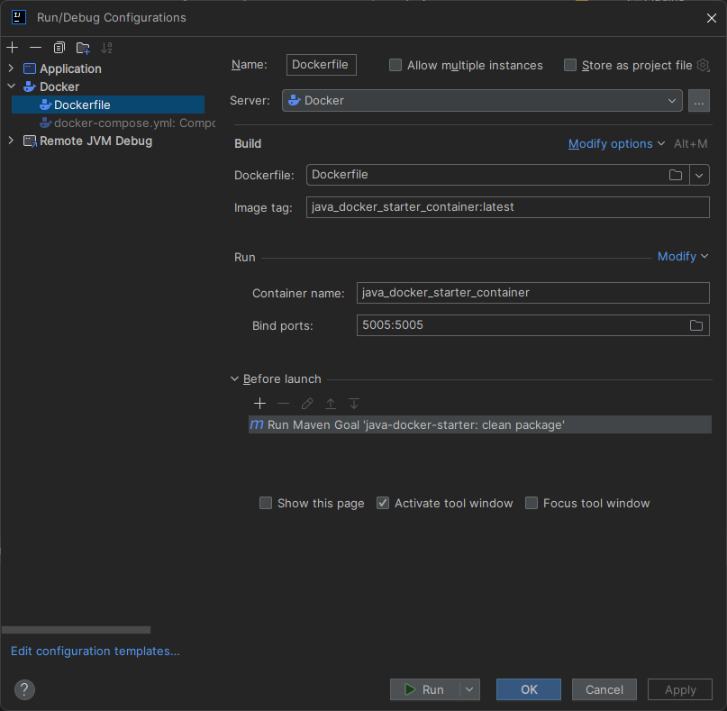
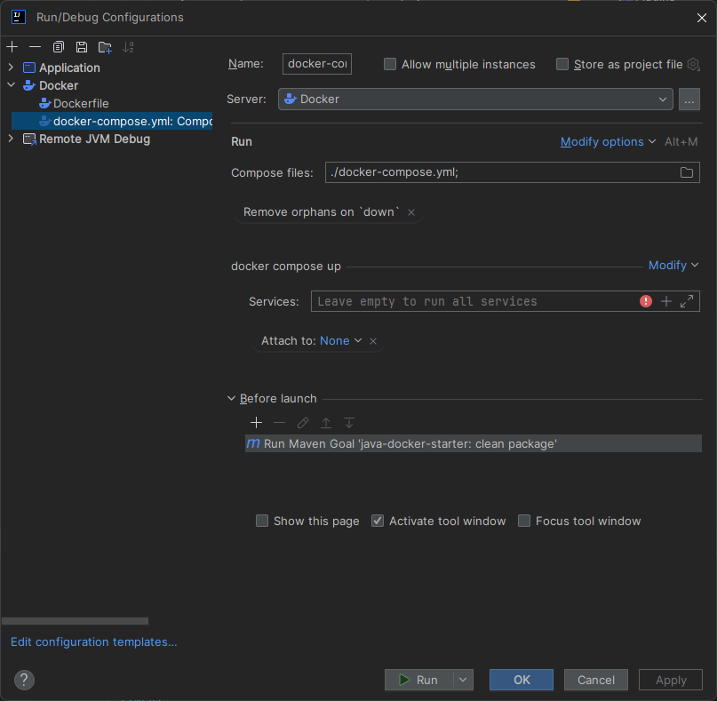
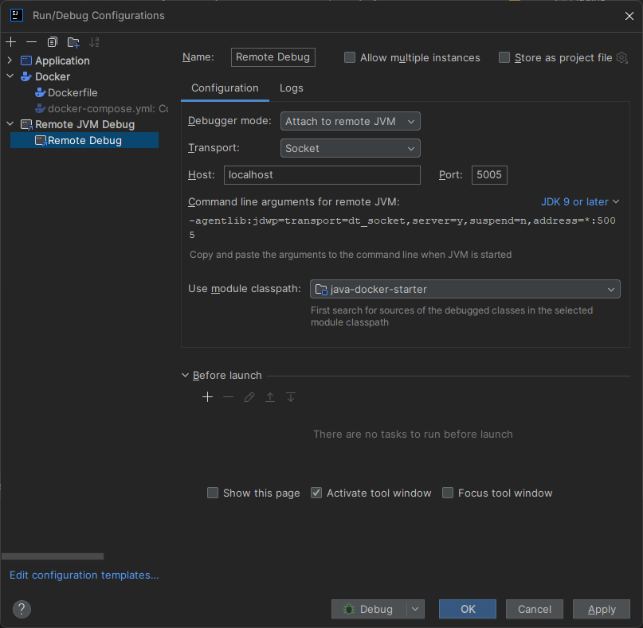

# 1. Configuration

## 1.1. Dockerfile

- docker build -t java_docker_starter_container:latest .
- docker run --name java_docker_starter_container -p 5005:5005 java_docker_starter_container:latest
  

## 1.2. Docker compose

- docker compose up -d
  

## 1.3. Remote Debug

